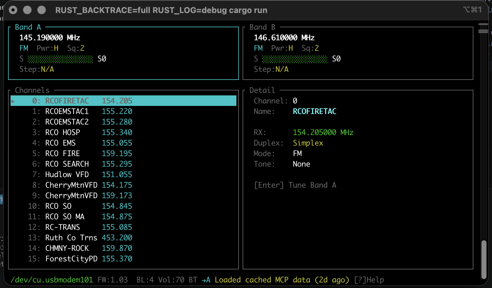

# kenwood

Rust libraries and TUIs for Kenwood amateur radio transceivers.

> **WARNING: This project is a work in progress. Use at your own risk. There are no guarantees that this software will not damage, brick, or otherwise render your radio inoperable. Incorrect memory writes can corrupt radio configuration. Do not use this on a radio you are not prepared to factory reset or send in for service.**

## Radios

| Radio | Library | TUI | Status |
|-------|---------|-----|--------|
| TH-D75 | `thd75/` | `thd75-tui/` | In development |
| TM-D750 | Planned | Planned | Not started |
