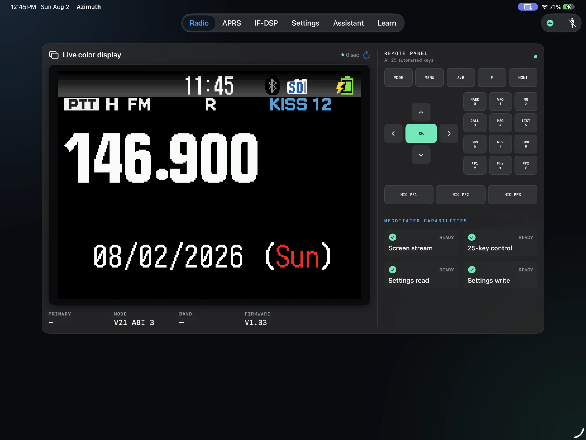
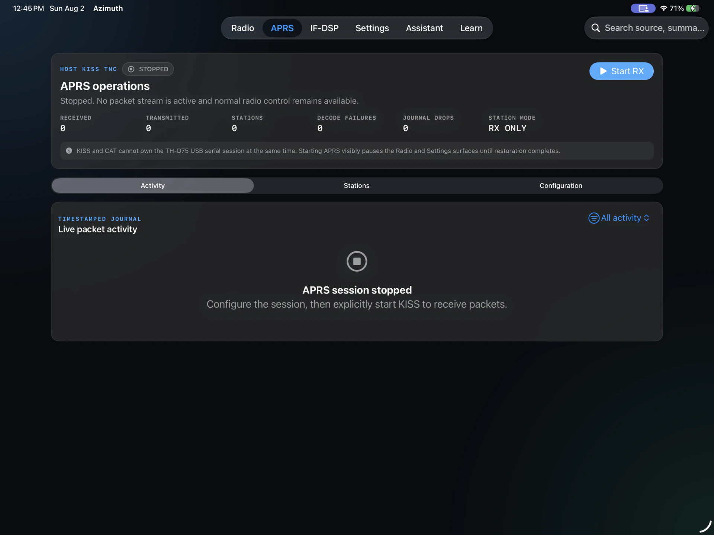
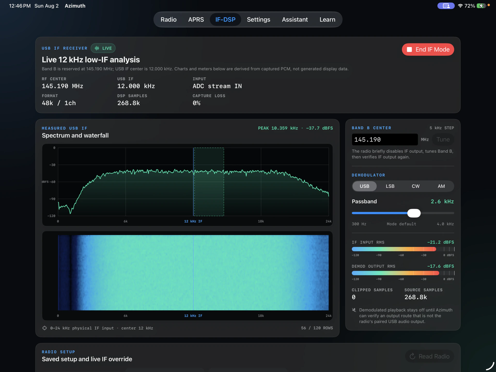
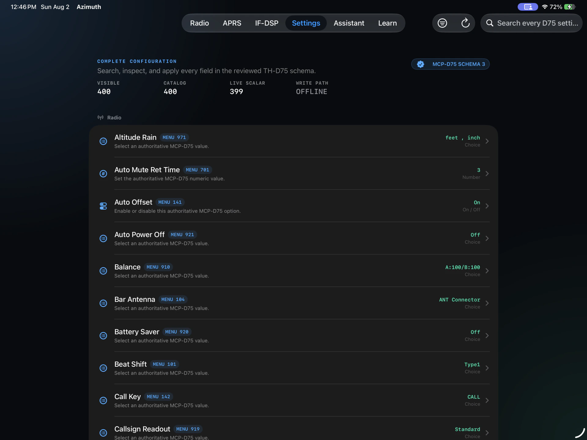
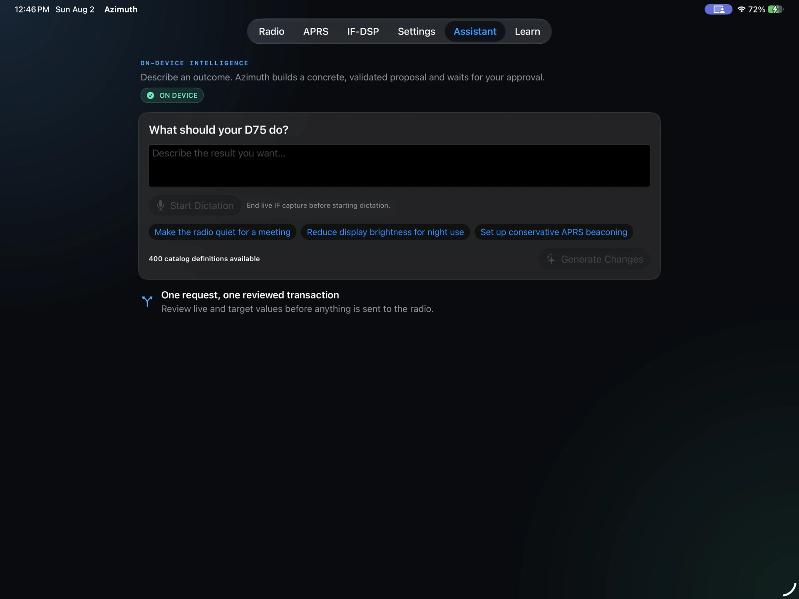
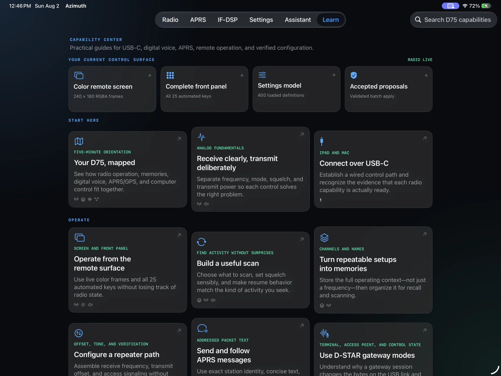

# Azimuth

Azimuth is a native iPadOS and macOS control center and field guide for the
Kenwood TH-D75.

## Product tour

<p align="center">
  <a href="screenshots/01-radio-remote-control.webp">
    
  </a>
  <br>
  <sub>Live TH-D75 color display, all 25 authenticated controls, and negotiated capabilities. Click for the full-size view.</sub>
</p>

<p align="center">
  <strong>Radio</strong> ·
  <a href="screenshots/02-aprs-packet-activity.webp">APRS</a> ·
  <a href="screenshots/03-if-dsp-spectrum-waterfall.webp">IF-DSP</a> ·
  <a href="screenshots/04-settings-catalog.webp">Settings</a> ·
  <a href="screenshots/05-assistant-on-device-automation.webp">Assistant</a> ·
  <a href="screenshots/06-learn-capability-center.webp">Learn</a>
</p>

<details>
<summary><strong>Explore all six workspaces</strong> — compact gallery</summary>
<br>
<table>
  <tr>
    <td width="50%" align="center">
      <a href="screenshots/01-radio-remote-control.webp"></a><br>
      <strong>Radio</strong><br><sub>Live LCD and authenticated 25-key remote panel.</sub>
    </td>
    <td width="50%" align="center">
      <a href="screenshots/02-aprs-packet-activity.webp"></a><br>
      <strong>APRS</strong><br><sub>KISS controls, counters, stations, and packet journal.</sub>
    </td>
  </tr>
  <tr>
    <td width="50%" align="center">
      <a href="screenshots/03-if-dsp-spectrum-waterfall.webp"></a><br>
      <strong>IF-DSP</strong><br><sub>Physical IF spectrum, waterfall, tuning, and levels.</sub>
    </td>
    <td width="50%" align="center">
      <a href="screenshots/04-settings-catalog.webp"></a><br>
      <strong>Settings</strong><br><sub>400 reviewed fields with menu numbers and live values.</sub>
    </td>
  </tr>
  <tr>
    <td width="50%" align="center">
      <a href="screenshots/05-assistant-on-device-automation.webp"></a><br>
      <strong>Assistant</strong><br><sub>Approval-gated planning with mode-safe dictation.</sub>
    </td>
    <td width="50%" align="center">
      <a href="screenshots/06-learn-capability-center.webp"></a><br>
      <strong>Learn</strong><br><sub>Task-oriented field guides for the complete radio.</sub>
    </td>
  </tr>
</table>
</details>

## Product pillars

- **Radio at a distance.** Show the V1.03.AZM-authenticated 240×180 LCD and
  route every virtual key through the firmware's one-use full-frame guard.
- **Every setting, understandable.** Present all 400 reviewed writable MCP
  fields with search, official option domains, staged diffs, confirmation,
  stale-value protection, and read-back verification.
- **Ask Azimuth.** Use Apple's on-device Foundation Models framework to turn
  natural language into a typed, explainable before-and-after plan. The model
  never emits raw CAT bytes or memory offsets. Azimuth validates every item,
  presents Accept and Decline, and automatically performs the complete batch
  through the trusted radio controller only after the operator accepts it.
- **Learn the D75.** Ship an original, searchable capability guide with
  task-oriented walkthroughs and contextual help.
- **USB first.** Use USB-C on M-series iPads through USBDriverKit, and the
  system CDC serial device on macOS.

## Safety contract

The model cannot touch the radio. Reversible changes require a concrete diff
and explicit acceptance; Decline sends nothing. Memory edits require a live
review snapshot, stale-value checks, and verified read-back. Reset, firmware,
identity/location, and transmit operations require dedicated UI and are never
inferred or executed autonomously by the language model.

## Development

```bash
../azimuth-core/scripts/build-xcframework.sh
xcodegen generate
open Azimuth.xcodeproj
```

USBDriverKit requires a physical M-series iPad and a TH-D75. The Simulator is
for UI, assistant, catalog, and recorded-transport tests.

Lifecycle, recovery, and failure diagnostics are logged by default. Set the
scheme environment variable `AZIMUTH_VERBOSE_USB_TRACE=1` when packet-by-packet
core, transport, and doorbell tracing is needed.
