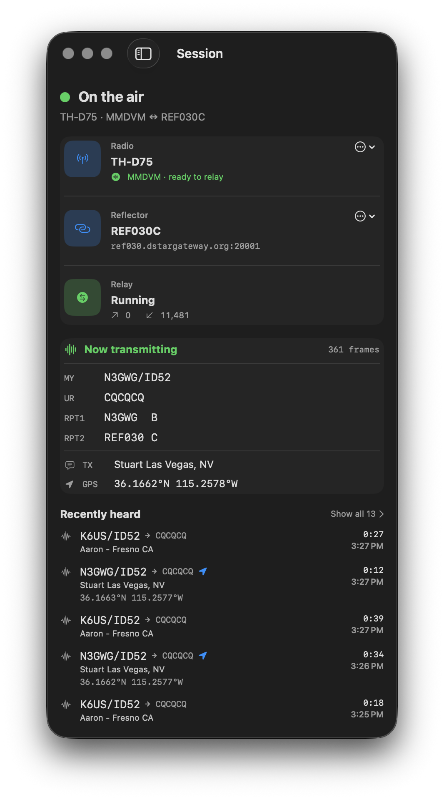

# Lodestar — native macOS + iPadOS app

D-STAR gateway app for the Kenwood TH-D75. Runs on iPad (iPadOS 17+)
and Mac (native macOS 14+).

- macOS connects to the radio over Bluetooth Classic SPP via `IOBluetooth`.
- iPad direct radio access uses USB-C CDC via an embedded DriverKit driver
  extension (M-series iPads only). The Swift transport scaffolding ships;
  the dext implementation is iterating on real hardware.
- iPhone is out of scope — Apple offers no public path from iPhone to a
  non-MFi USB-C or Bluetooth Classic SPP accessory.



## Build

```bash
# One-time: build the Rust xcframework
../lodestar-core/scripts/build-xcframework.sh

# Generate the Xcode project
xcodegen generate

# Open in Xcode
open Lodestar.xcodeproj
```

## License

GPL-2.0-or-later OR GPL-3.0-or-later.
