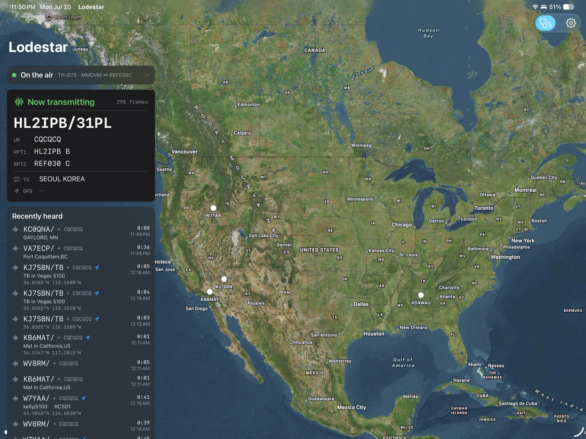

# Lodestar: native macOS + iPadOS app

D-STAR gateway app for the Kenwood TH-D75. Runs on iPad (iPadOS 26+)
and Mac (native macOS 26+).

- **macOS** connects to the radio over Bluetooth Classic SPP via
  `IOBluetooth`. The app re-executes its signed binary as a disposable
  helper: only that child owns IOBluetooth/RFCOMM, and the parent can kill and
  reap it if a framework write stalls. Cancelled or uncertain writes require
  an explicit fresh connection; cancelling a read preserves buffered bytes.
- **iPad** connects to the radio directly over USB-C: an embedded
  DriverKit extension drives the TH-D75's CDC serial interface on
  M-series iPads. Enable the driver once in **Settings → General →
  Drivers** after installing, then plug the radio in with a
  data-capable USB-C cable. Reflectors also work with no radio at all
  (TX/RX over IP).
- **iPhone** is out of scope: Apple offers no public path from iPhone
  to a non-MFi USB-C or Bluetooth Classic SPP accessory.

With the radio in Reflector Terminal mode and a reflector linked, the
relay starts automatically and bridges voice both ways. If the radio is
in the wrong mode, the app reads and fixes the relevant settings
itself: no menu keypresses on the radio.



## The session screen

One adaptive screen, driven by the actual window width, not the
device:

- **Wide** (13″ iPad landscape, a wide Mac window): a full-bleed
  hybrid-satellite map of every station heard (latest position per
  callsign, with the live station's pin pulsing while keyed) behind a
  rail showing the connection chain, a large now-transmitting card, and
  the full heard history. The chain collapses to a one-line status
  strip while healthy and re-expands when anything needs attention.
- **Narrow** (floating window, Split View): the same content as a
  single scrolling column with a fixed-height map card. Resizing either
  way is non-destructive.

Tap any station (a heard row, the live speaker's callsign, or a map
pin) for its details and actions: QRZ lookup, copy callsign, TX
message, or coordinates, and open in Maps. Long-press (right-click on
the Mac) offers the same actions as a menu. Radio diagnostics live in a
toolbar-toggled inspector on wide layouts and inline on narrow ones.

## Background operation (iPad)

While linked to a reflector the app keeps working in the background:
monitor audio keeps playing and the USB relay keeps bridging with the
screen off or another app in front. Unlinked and idle, it suspends
normally. Expect extra battery use while linked in the background.

## Build

```bash
# One-time: build the Rust xcframework
../lodestar-core/scripts/build-xcframework.sh

# Generate the Xcode project
xcodegen generate

# Open in Xcode
open Lodestar.xcodeproj
```

Run the `LodestarMac` scheme on the Mac, or deploy `LodestarIPad` to an
M-series iPad. DriverKit needs real hardware (the Simulator never
loads the driver), and development builds work on any paid Apple
Developer account via automatic signing; only App Store / TestFlight
distribution needs Apple's DriverKit approval.

## License

GPL-2.0-or-later OR GPL-3.0-or-later.
